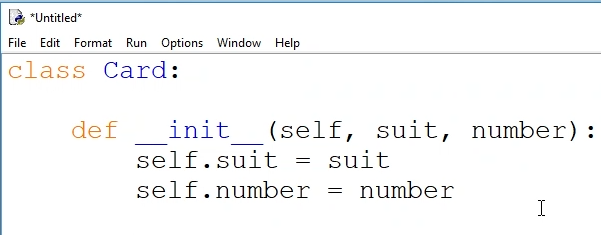
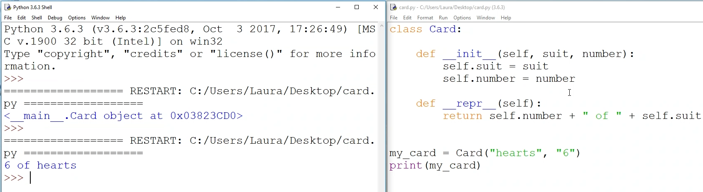
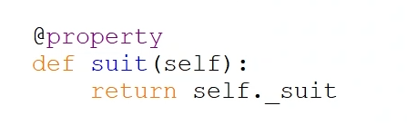
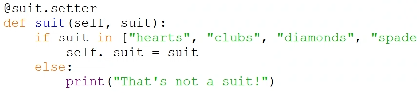
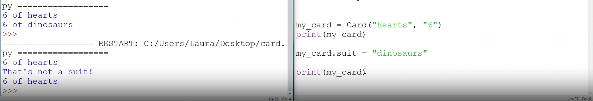

# Creating a deck of cards using object-oriented programming (OOP) in Python

Below, you'll find a step-by-step guide to create a deck of cards, shuffle them, and deal them to players.

## Prerequisites

- Any computer with a modern web browser and internet connection
- Python 3 or higher

## Step 1: Define the Card class

We'll start by defining a class for a single playing card. Each card will have a suit and rank.

1. Define the Card class.
2. Initialize the suit and rank attributes in the constructor.
3. Implement a __str__ method to display the card's suit and rank.

<i>init</i> means to create or begin something. In this case, we're creating a new card object and initializing it with a suit and rank.

<i>attributes</i> are pieces of information that are associated with an object. In this case, the **suit** and **rank** are attributes of the <u>card</u> object.

## Step 2: Instantiate an object

Now that we've defined the Card class, we can create a card object.

1. Create a card object for the 6 of hearts. Below is your class definition, instantiate a card object called "my_card" for the 6 of hearts.

2. Print the card object to see the suit and rank.

## Step 3: Attributes and properties

Properties are the special methods that either get or set the value of an attribute, and are therefore referred to as the getter and the setter.

Accessing the attributes directly is not a good practice. Why? Because it's possible to set the value of an attribute to something that doesn't make sense. 

Creating a getter and setter for each attribute allows us to control the values that are assigned to the attributes.

1. Go back to your Card class definition, add a new method called suit and have it return the suit attribute. Add a **decorator** to this method called @property. This decorator tells Python that this method is a property.

Create the setter by adding another method. This method should be called suit and take a parameter called suit. Add another decorator to this method called @suit.setter. This decorator tells Python that this method is a setter.

Run the program and try to change the card's suit to something other than a valid suit. What happens? 

**You should be seeing the error message we created while defining the setter in the previous steps. "That's not a suit!"**

